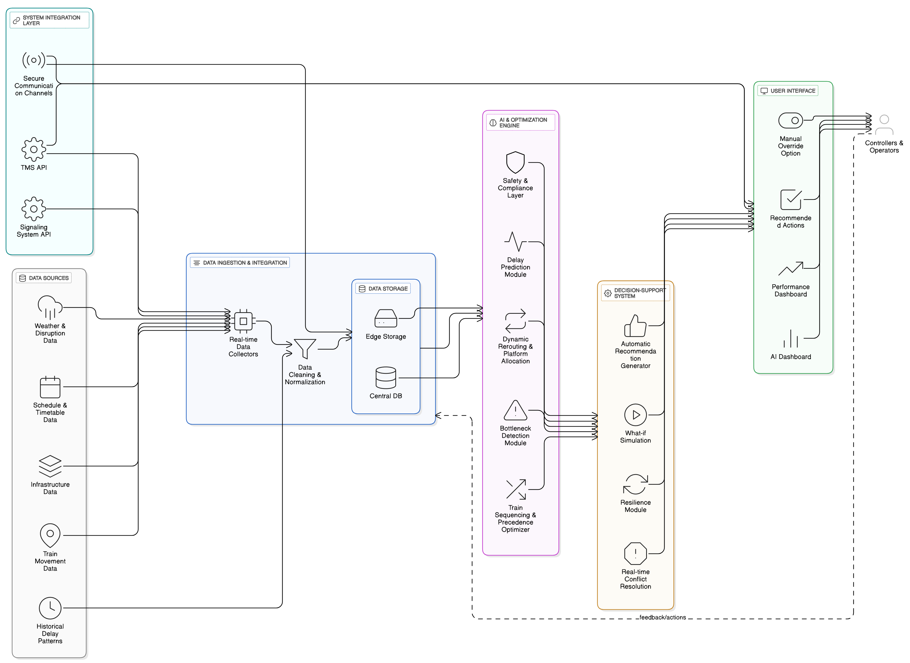

# 🚀 Trackmitra
_A smart companion for real time tracking and instant assistance._

---

## 📌 Problem Statement
SIH25022 : Maximizing section throughput using AI-Powered precise train traffic control.

---

## 💡 Our Solution
-> 

---

## 🛠️ Tech Stack  


---

## ✨ Features
✅   

---

## 🏗️ Architecture 


---

## ⚙️ Installation & Setup  

### Clone the repo  
```bash
git clone https://github.com/GitSetGoRishabh/sih-2025-trackmitra.git
cd sih-2025-trackmitra
```

### Backend setup
```bash
cd backend
npm install
npm start
```

### Frontend setup
```bash
cd frontend
npm install
npm run dev
```

## 📱 Demo


## 📑 Documentation


## 👨‍👩‍👧 Team Members
1. **Rishabh Singh Yadav** - Leader [GitHub](https://github.com/GitSetGoRishabh) | [LinkedIn](https://linkedin.com/in/rishabhsinghyadav0208)
2. **Sayan jana** - [GitHub](https://github.com/httpssayan) | [LinkedIn](https://linkedin.com/in/sayan-jana-1267b8314)
3. **Akshat Yadav** - [GitHub](https://github.com/alias-codes) | [LinkedIn](https://linkedin.com/in/akshat-yadav-240467330)
4. **Kumari Ayushi Sahoo** - [GitHub](https://github.com/ayushisahoo22) | [LinkedIn](https://linkedin.com/in/ayushi-sahoo-539652341)
5. **Priyanshu Maurya** - [GitHub](https://github.com/Priyanshu1617Maurya) | [LinkedIn](https://linkedin.com/in/priyanshu-maurya-68442833b)
6. **Manya Tripathi** - [GitHub](https://github.com/manyat00) | [LinkedIn](https://linkedin.com/in/manya-tripathi-46704a303)

## 📜 License
This project is licensed under the MIT License.
